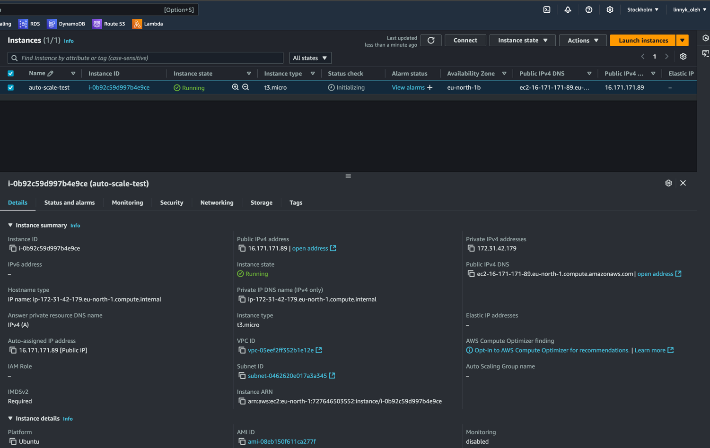
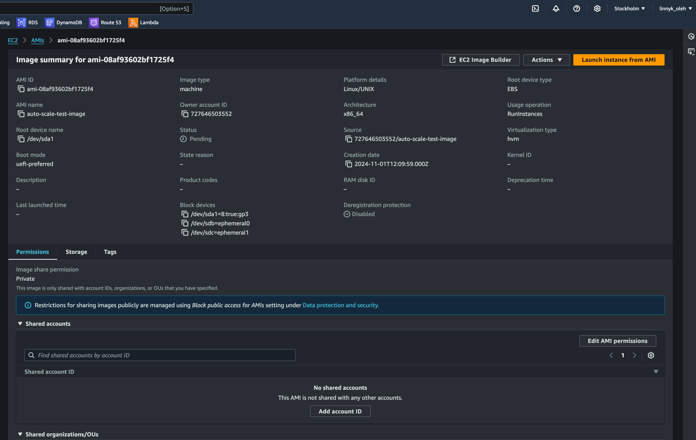
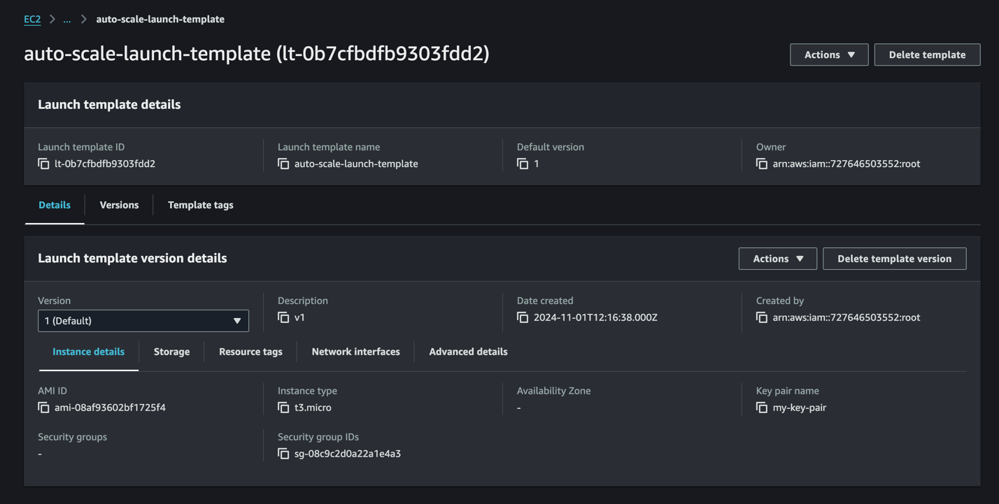
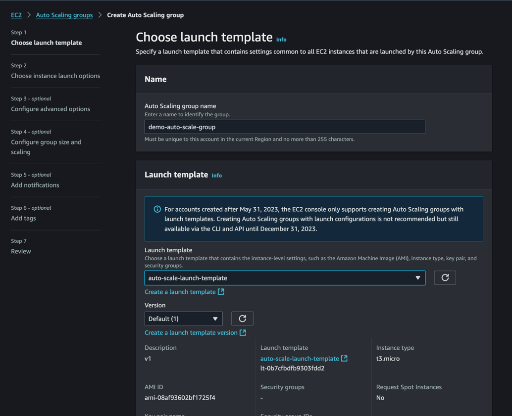
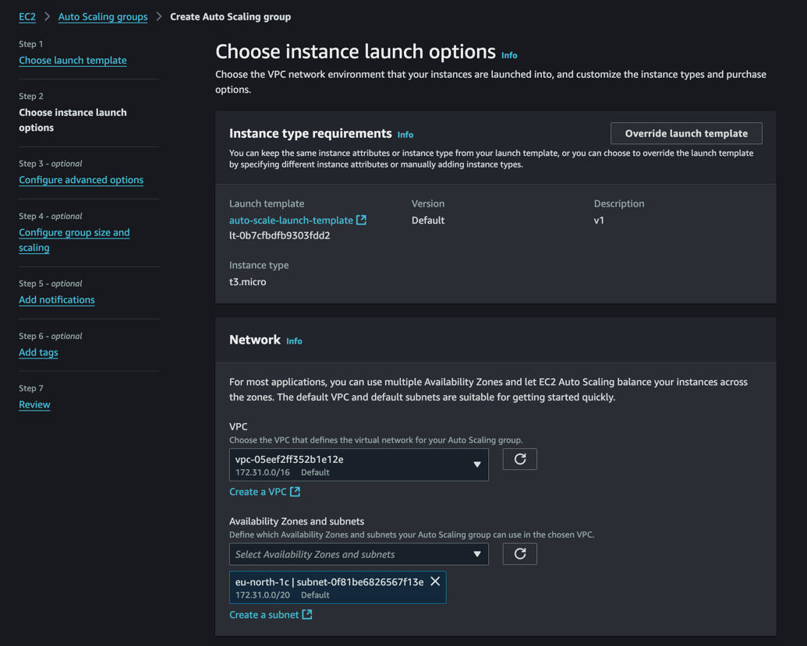
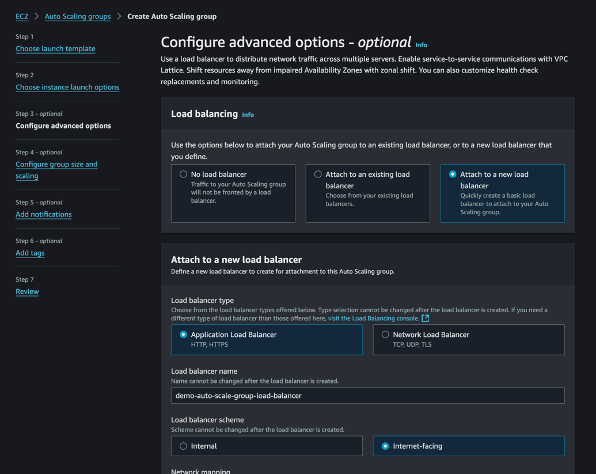
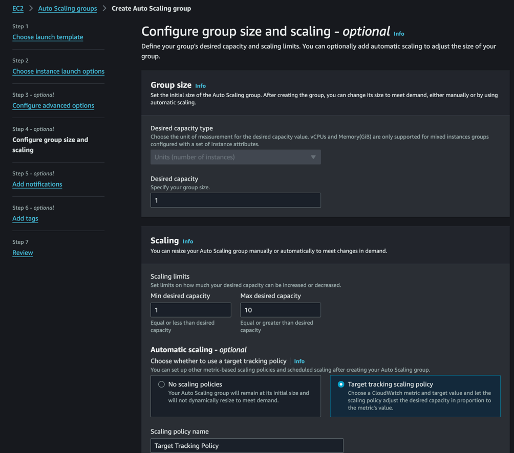
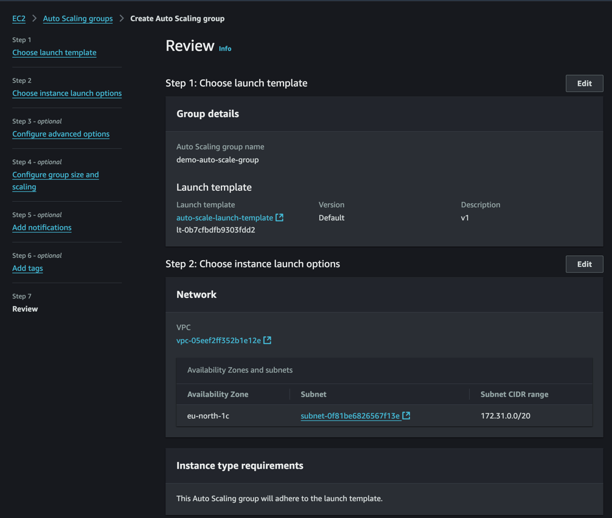
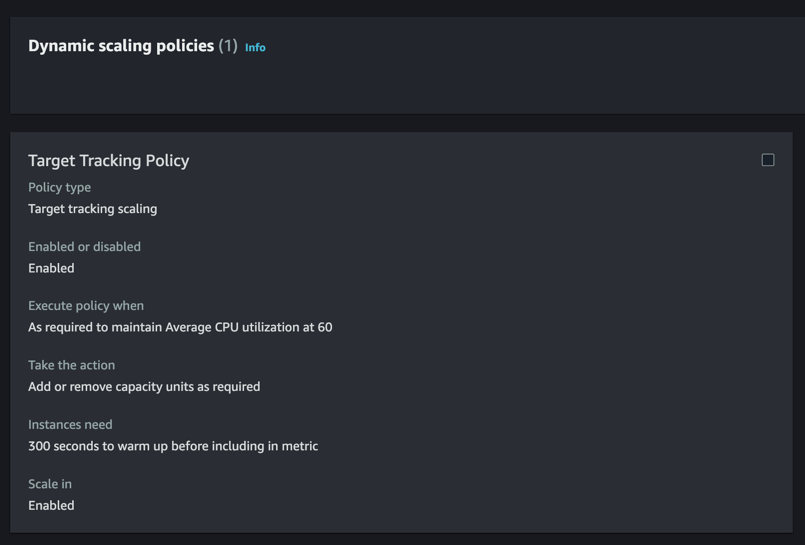

# Scale It!

## Create autoscale group that will contain one ondemand instance and will scale on spot instances.

### Launch ec2 instance

### Create AMI from the instance

### Create launch template

### Create autoscaling group

## Set up scaling policy based on AVG CPU usage.

## Set up scaling policy based on requests amount that allows non-linear growth.

